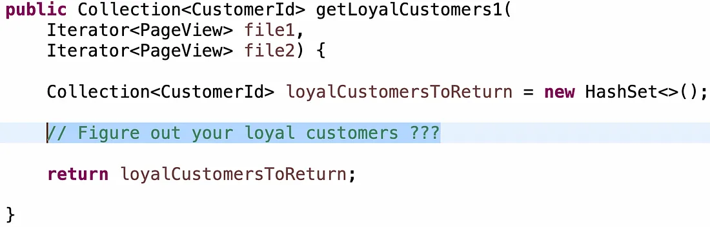
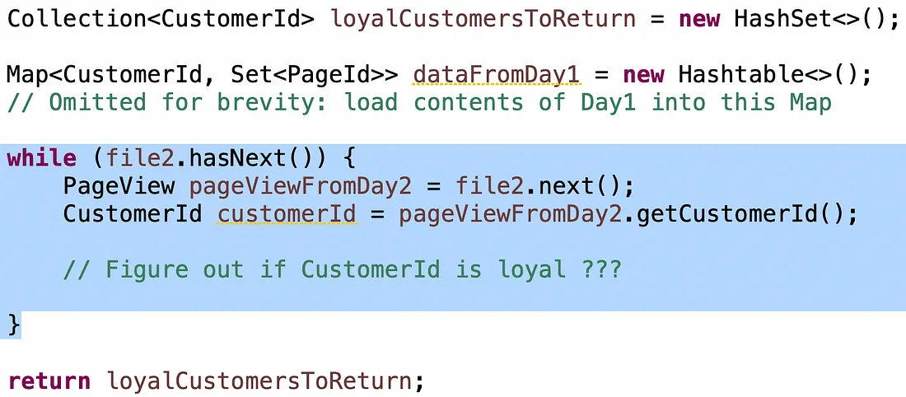
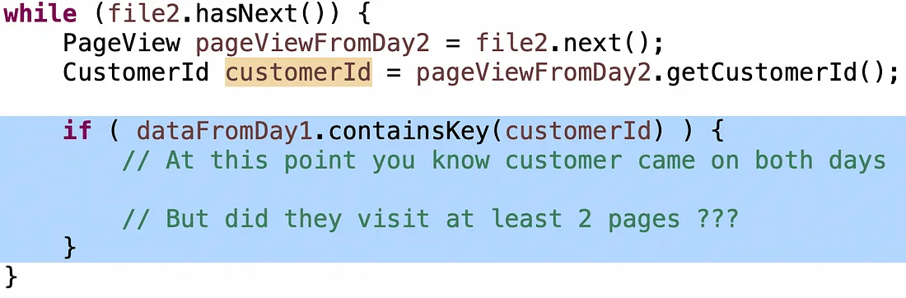
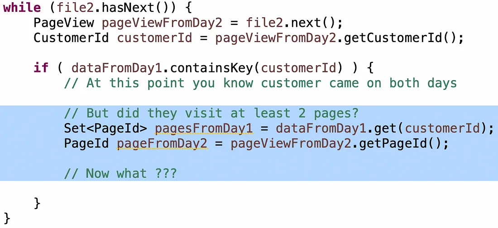
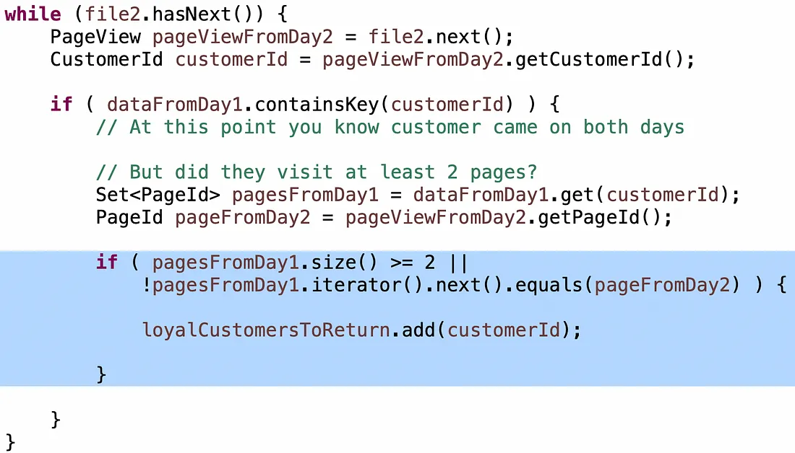
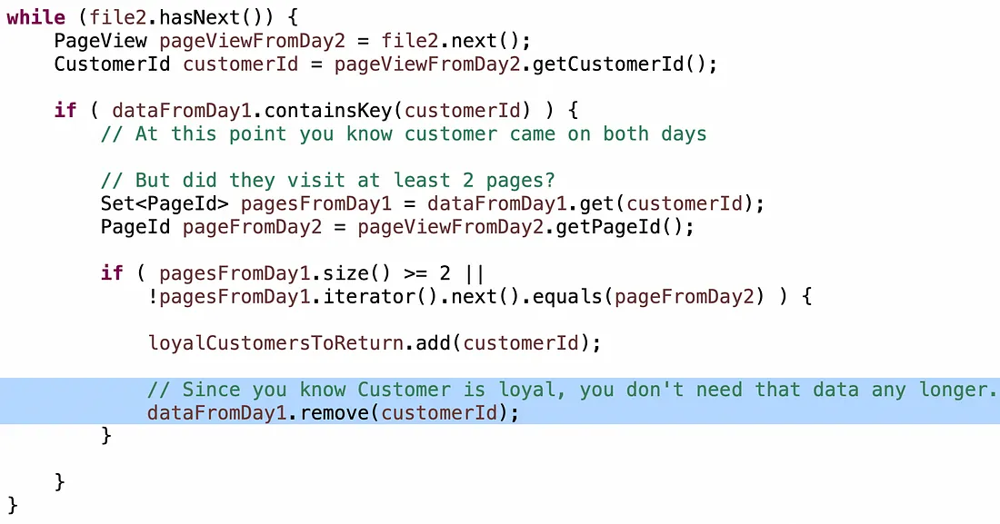

This is taken from this Medium article: https://carloarg02.medium.com/my-favorite-coding-question-to-give-candidates-17ea4758880c

Title: My favorite coding question to give candidates (and why)

Author: Carlos Arguelles

November 12, 2023

----

There’s so many blogs and videos online showing you answers to LeetCode questions. But the viewpoint is mostly as an interviewee, not as an interviewer.

In my 25 years in Big Tech, I’ve conducted over a thousand interviews (eight hundred at Amazon as a Bar Raiser, a couple of hundred at Microsoft, and shy of a hundred at Google).

Big Tech has 3 types of interviews for Software Engineers: [1] Coding, [2] Systems Design, [3] Leadership, soft skills, culture, etc. Loops tend to have a blend of these. For example an SDE-I might have 3 coding, 1 design, 1 leadership, while a Principal Engineer might have 1 coding, 2 design, 3 leadership. I personally prefer the more open-ended Leadership interviews, as I feel I learn more about the candidates that way. But Coding interviews are a necessary evil.

Now, disclaimer: all coding interview questions are terrible, including mine. You have 45 minutes to make a hire recommendation that could change somebody’s life. People are never themselves: it’s stressing, they are exhausted and there is an artificial time limit. The questions are contrived to fit within the timeframe and get specific signals. I tend to favor easier questions that lead to a high quality conversation where I can learn about the way somebody thinks. The conversation is much more important to me than the actual lines of code my candidate writes on the whiteboard. What tradeoffs exist? How do you balance between them? As an interviewer, it’s on ME to know how to help my candidate have a good experience, when to guide, and when to probe, and how to calibrate my expectations for an artificial setting.

For coding interviews, I have often asked a variation of the following problem, loosely based on something I had to do in real life. Since I decided to retire the question, I’ll dissect it today. What did I look for? What did I see candidates do?

**The Problem**

Let’s say we have a website and we keep track of what pages customers are viewing, for things like business metrics.

Every time somebody comes to the website, we write a record to a log file consisting of Timestamp, PageId, CustomerId. At the end of the day we have a big log file with many entries in that format. And for every day we have a new file.

Now, given two log files (log file from day 1 and log file from day 2) we want to generate a list of ‘loyal customers’ that meet the criteria of: (a) they came on both days, and (b) they visited at least two unique pages.

The question is not particularly difficult, but it does require a little bit of thinking and knowledge of code complexity and data structures. You can easily get the customers that came on both days, you can easily get the customers that visited at least two unique pages, but getting the intersection of those two efficiently requires a little more work.

I’ve probably asked it 500 times, which has allowed me to calibrate it quite well. I have found that a Hire decision from this question aligns with the final loop Hire decision on a candidate about 95% of the times. I can also upscale it for higher level candidates, which makes it fairly versatile, and there’s many hints I can give to candidates struggling along the way.

**Ask Clarifying Questions**

Great candidates must ask clarifying questions before jumping into coding. I’m hoping to see some intuition from my candidates as I’ve actually expressed the problem in an ambiguous way.

Did I mean 2 unique pages per day or overall?

This significantly impacts the solution. I mean “2 unique pages overall” because that’s a much more interesting problem. About half the candidates jump straight into coding without clarifying this, and out of those, half assume incorrectly that I meant “2 unique pages per day.” If it’s a more junior candidate, I’ll hint heavily before they start coding. If it’s a more senior candidate, I’ll wait a bit and see if that comes up as they’re thinking more deeply about the algorithm.

In real life, engineers deal with ambiguity all the time, and the root of most software problems can be traced back to poorly defined requirements. So I want to get a signal on spotting and dealing with ambiguity.

There’s one more clarifying question that 90% of people miss upfront, but that also matters: What about duplicates? Visits to the same page in the same day? Visits to the same page on different days? For this problem, these are duplicates.

Another clarifying question that matters is what scale are we talking about here? Does the data fit in memory? Can I load the contents of one of these files in memory? Can I load the contents of both?

The question was inspired by a real-world system that I worked on at Amazon, called Clickstream, that was responsible for tracking user behavior on amazon.com. We processed petabytes of events from millions of concurrent customers on a giant MapReduce cluster of 10,000 hosts, and we had an entire team of engineers maintaining and operating it. But for the purposes of a 45-minute interview, just imagine the data fits in memory, with a much smaller scope.

Lastly, another clarifying question that is important is how much does Performance vs Memory vs Maintainability matter? There’s a naive solution that is O(n²) in running time, but only uses O(1) of memory. There’s a better solution that has running time of O(n) but uses O(n) of memory. And there’s an in-between solution that does some pre-processing in O(n log n) with O(k) of memory, then the main algorithm is O(n) with O(1) of memory. Each one has pros and cons. Some of the heuristics you may use for improving performance or memory usage may make the code harder to read and evolve later on. On more senior candidates, I’m hoping to have a spirited chat about these.

**Naive solution first**

In theory you could write a pretty simple SQL query, and sure, Big Tech companies have giant data warehouses where you can easily do this sort of thing. But for the scope of a coding interview, you wouldn’t want to. Since this is not a distributed systems problem and the data fits in memory, why introduce the additional complexity and dependencies of a database for something that you can solve with 20 lines of simple code?

Starting point:

About 80% of the candidates go for the naive solution first. It’s some form of “for each element from file 1, loop for all the contents of file 2, looking for elements with the same customer id, and keeping track of the pages they view.”

The problem with the naive solution is that its running time is O(n²).

I don’t mind getting the naive solution first, but I really want to see my candidate having that 'aha' moment that O(n²) is probably never good in any problem. And I want that 'aha' moment to come pretty quickly and without hints. No great engineer should ever settle for an O(n²) algorithm, unless bound by memory or some other unmovable constraint.

After a candidate puts forth the O(n²), I smile politely and I wait. I am really hoping the next words that come out of their mouth are “…but the complexity of this is O(n²) so can I do better?” If not, I’ll probe, “what’s the running time of this solution”? And most of the times, the candidate will have the 'aha' moment after that hint and move on to a better solution.

**Tuning O(n²) into O(n)**

At this point you need to do some thinking about what data structure you’re going to use, and how you’re going to store your data.

Poor candidates go for linked lists, or arrays. These have O(n) search, therefore you’ll end up back to an O(n²) algorithm no matter how hard you try. You can use a Tree, but since search is O(log n), that’ll yield an overall best of O(n log n).

Better candidates have the intuition that a Map will provide the O(1) lookup that they need to turn the O(n²) algorithm into an O(n) algorithm. Great candidates will proactively point out the downside is that you’ll use O(n) memory. If you want to be more pedantic about it, you can even point out maps have the hidden cost of running a hashing function over and over again, which can be expensive. Overall, faster running time at the expense of more memory is a good tradeoff to highlight.

If you’re using a Map, what is your Key, and what is your Value? I’ve seen all kinds of answers here. Some candidates use PageId as the Key, and CustomerId as the Value, but that is not going to help. Candidates then switch it around to have CustomerId as the Key, and PageId as the Value of the Map. But that’s not particularly great either because it overlooks the fact that you can have many pages per customer, not just one. Some candidates have the intuition that they need a Collection of pages as the Value of the Map, but they’ll go for a List, which saddens my soul because it overlooks the fact that you can have duplicates. This is a good opportunity to probe around data structure knowledge on Lists vs. Sets, as candidates think about handling duplicates.

So, Map<CustomerId, Set<PageId>> will do. But will you load the contents of both files into a single Map? Or have two maps, one for each file? Or can you get away with just loading the contents of file 1 into a map, and processing file 2 without storing it?

Great candidates realize they can go for option#3 right away on their own. That’s a lot less memory, and a simpler algorithm. Good candidates get there, but need a little hinting.

The condition “customers that came on both days” is pretty simple: as you’re reading a customer entry from Day2, if the customer is in the Map from Day1, then you know they came on both days:

The condition “customers that visited at least 2 unique pages” tends to be a little harder for candidates to get right, so if they’re stuck I throw a little hint: you have a Set of pages from Day1, and a single page from Day2… how can you determine that this is at least two unique pages?

Poor candidates will loop through the elements in the Set to check if the page from Day2 is in there. This turns your O(n) algorithm into O(n²) again. The number of candidates who have done this is surprising. Better candidates will do a .contains() on the Set which is an O(1) operation on a hash set. But there is still a catch with the logic.

The intuition to get this right is this: If you are inside that If loop and the customer visited at least two pages in Day1, and they visited any page in Day2, they’re loyal, regardless of which page they visit in Day2. Otherwise, they only visited only one page in Day1, so the question is: is this a different page? If so they’re loyal, else it’s a duplicate so you don’t know and should keep going.

You need attention to detail, like using “>” instead of “>=” or missing the “!” in the second clause. I saw these fairly often. I didn’t worry. Great candidates spotted them quickly as they double-checked the algorithm when they were done. Good candidates spotted them after a little bit of hinting. That gave me a good signal on debugging skills.

**Optimizing Your Solution**

If candidates get to this point and we have some extra time, it’s kind of nice to probe on how to optimize for either speed or memory usage. Bonus points for some discussion about tradeoff between these versus future maintainability.

For example, if memory is a constraint, you don’t need to actually keep every single page from Day 1 in the Map, just two, since the problem is “at least two pages” so a Set of size 2 or even an array of size 2 will use less memory than an unbounded Set.

Or, if you’ve already determined that a customer is loyal, you don’t need to waste CPU cycles going thru the logic again next time you encounter that customer in Day 2.

A word about optimizing: you could argue that these optimizations make it more difficult to change the algorithm if the requirements change in the future. That’s a reasonable stand. As long as you can hold a good conversation about pros and cons, I am happy with a high quality discussion on how you would balance these decisions. At the same time, being able to optimize an algorithm when needed *is* a trait of a great engineer and you *will* need to do that a time or two in your career.

**The Other Solution**

The vast majority of candidates go for the Map approach, but sometimes I have a candidate go for the other one. Maybe 5% of the time at most.

What if you pre-processed the files and sorted them by CustomerId, then by PageId?

Pre-processing is a powerful tool in your software engineering arsenal, particularly if you’re going to be performing an operation a bunch of times. You can take the hit of pre-processing with the first one, or do it beforehand, which amortizes the cost over time. Sorting the files can be an O(n log n) operation with constant memory.

If the files are sorted, then the problem is easier and it’s just a two-pointer algorithm that you can execute in O(n) with O(1) of memory. You move the pointers for file 1 and file 2 until they’re both on the same CustomerId, which means they came on both days. Since the second sort key is by PageId, you use another two-pointer algorithm to determine that there are at least two unique pages. So it’s a 2-pointer algorithm within a 2-pointer algorithm. It’s kind of a fun problem! I’ll leave the actual implementation as an exercise for the viewer.

**In conclusion**

I hope this little insight into a coding problem from the viewpoint of an interviewer, and the ways in which I’ve seen great, good and poor candidates approach it, has been useful to you. Best of luck in your next interview!