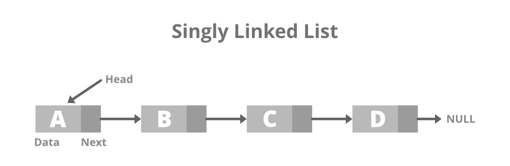

# Linked Lists

A linked list is a linear data structure in which elements are not stored at contiguous memory locations. This means that the data is stored wherever there is free space in memeory, and not right next to each other like arrays. Instead, each element (referred to as a node) points to the next element by means of a pointer. Linked lists provide a dynamic way of storing data, which can grow and shrink in size efficiently.

A linked list consists of nodes where each node contains:

- Data (the value stored in the node)
- A pointer (or reference) to the next node in the sequence

# Singly Linked List

A singly linked list is the simplest type, in which every node contains some data and a pointer to the next node of the same data type.



To create a linked list, we need a 'Node' class which represents each node.

```js
// Node of a singly linked list 
class Node { 
    constructor() { 
        this.data = 0; 

        // Pointer to next node 
        this.next = null; 
    } 
} 
```

To traverse the list, and print it, the function would look like this:

```js
// Function to print the content of linked list starting from the given node 
function printList(node) { 
    // Iterate until n reaches null 
  while (node != null) { 
    // Print the data 
    console.log(node.data + " "); 
    node = node.next; 
  } 
} 
  
// Driver Code 
let head = null; 
let second = null; 
let third = null; 
  
// Create 3 nodes
head = new Node(); 
second = new Node(); 
third = new Node(); 
  
// Assign data in first node 
head.data = 1; 
  
// Link first node with second 
head.next = second; 
  
// Assign data to second node 
second.data = 2; 
second.next = third; 
  
// Assign data to third node 
third.data = 3; 
third.next = null; 
  
printList(head);
```

## Advantages

- Unlike arrays, the size of a linked list can grow and shrink dynamically, which allows linked lists to handle varying amounts of data efficiently.
- Inserting or deleting elements in a linked list is more efficient than in an array. In a linked list, you only need to update the pointers, whereas, in an array, you might need to shift elements.
- Linked lists do not require blocks of memory being next to another one. This means that memory allocation is more flexible.
- Linked lists use exactly as much memory as they need, whereas arrays may have unused, allocated space.

## Disadvantages

- More complex to implement compared to arrays.
- Each element in a linked list requires additional memory for storing a pointer. For large lists, this may be an issue.
- Unlike arrays, which allow random access to elements, linked lists must be traversed sequentially. This means accessing an element in the middle of the list can be slower.

## Applications

- Can be used to form other data structures like stacks, queues, hash tables, and graphs.
- Can be used to implement 'undo' functionality in applications like text editors. Each state of the application can be stored in a node, and moving back and forth through the states is easy with linked lists.
- Operating systems use linked lists to manage processes, threads, and even for memory management.