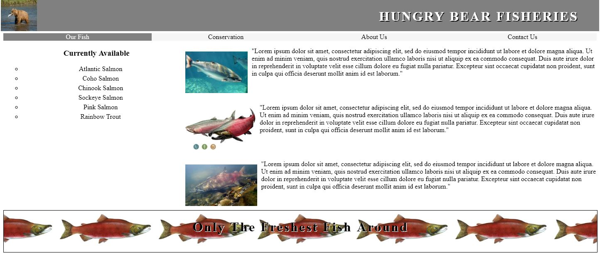

# Classwork

We will be utilizing the `layoutPractice.jpg` file as a starting point to create a site. This image could be used as a complete road map or it could be used as a starting point. Your site should have the following:

- The links across the top should be clear that they are clickable (think color change or some effect when hovered over).
- While it is just a single page at the moment, whichever page you're on should have its link be a different color to show that is the page you are on.
- Think about how you might style the menu differently on the left depending on your need.
- An image in the footer is not necessary, but if you don't use one, think about how you would get the text to appear above the image.

