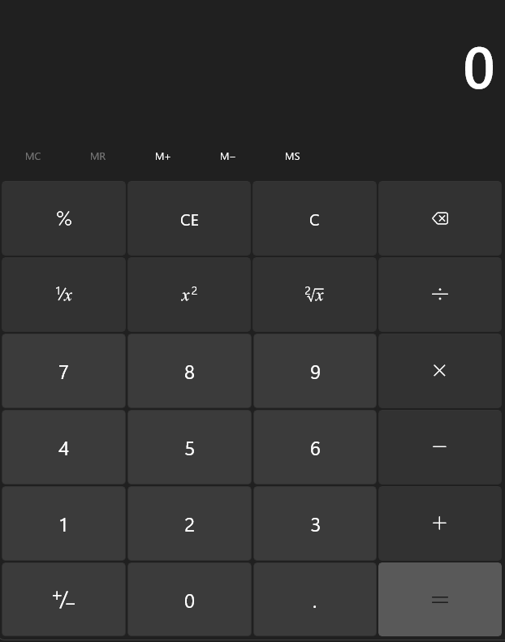

# Building a Calculator

Some things you might need:

- A div that functions as the input for the calculator.
- Number buttons for 0-9
- Operation symbol buttons for +, -, \*, /, power, C, CE, and =
  - Note: 'C' clears the entire display, 'CE' only deletes the last number or symbol in the display
- When a user clicks a number, add that to the screen (like a calculator).
- When a user clicks an action button, check for the following:
  - If they didn't press '=', add the current symbol to the display and allow the user to input the next number.
  - If '=' is pressed, perform the calculation and display the result.
    - Tip: try using the eval() function
  - If 'C' is pressed, clear the display.
- BONUS - Add functionality to use their keyboard for the calculator if they don't want to click buttons.

There's an example of what it might look like on calculator.png 

# Bugs

- If the buttons are disabled and they remove digits, we need to make the buttons enabled again until they get to the limit
- If you type in multiple symbols (like a bunch of + signs) it runs into an error