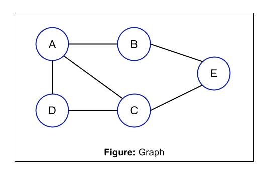

# Graphs

Graphs are very similar to trees, but without a defined structure. For example, you can have multiple paths between nodes. They can also have directions pointing to different nodes. Here's an example of what one would look like:

Some common uses of graphs:

- Social media networks: Each person is a node and the friendships are connections. This can be used to create algorithms which suggest mutual friends.
- Maps and GPS: Algorithms can find the shortest path between two nodes in a graph. This is how most GPS applications find the shortest route between your location and the destination. One of the most popular algorithms for this is Dijkstra's algorithm: (<https://www.w3schools.com/dsa/dsa_algo_graphs_dijkstra.php>)
- Computer networks: The connections between routers and different networks are represented as graphs.
- Neural Networks: Graphs are used to represent synapses in the brain, and a very similar concept is used for artifical intelligence.
